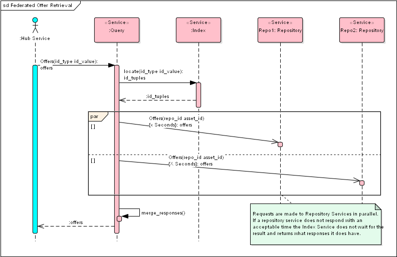
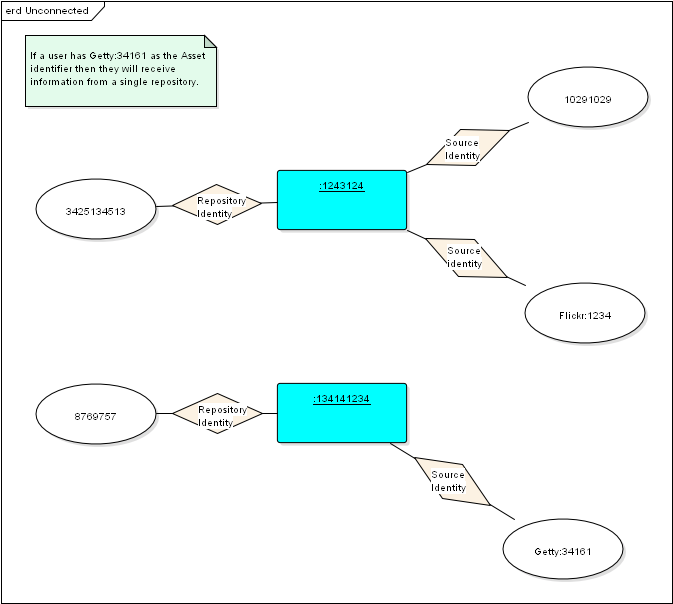
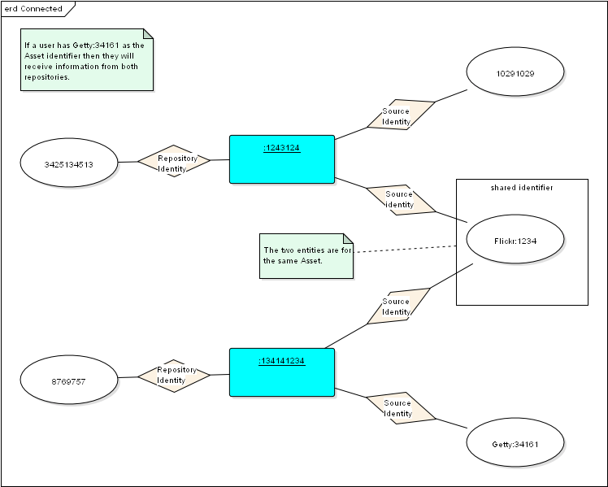
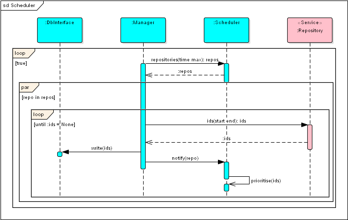
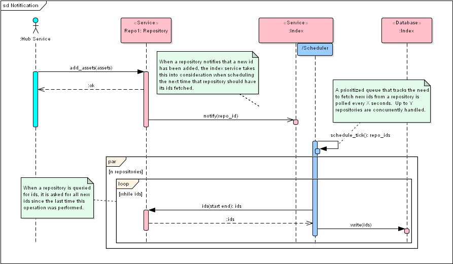
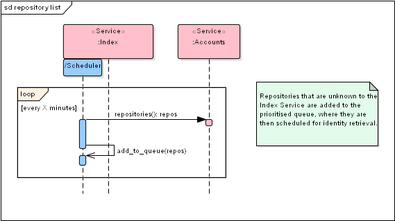

# Index Service Low Level Design

## Contents
+ [Overview](#overview)
+ [Problem Definition](#problem-definition)
+ [Design](#design)
    + [Constraints](#constraints)
    + [Assumptions](#assumptions)
    + [High Level View](#high-level-view)
    + [Entity Resolution](#entity-resolution)
    + [Scheduling](#scheduling)
    + [Notifications](#notifications)
    + [Repositories](#repositories)

# Overview
The Index Service is a component within the Open Permission Platform (OPP) that serves the purpose of keeping an index of identifiers and repositories in order to facilitate federated data retrieval and entity resolution.

This document describes a technical solution for this that works within the Open Permissions Platform, whilst trying to be readable.

Common technical design details of the services in the Open Permissions Platform can be found [here]().
The detailed API Specification of this service is available [here]().
The source code documentation can be generated by following the details in the [README]()
Other guides can be found on the [Developer Portal]()

# Problem Definition

Users want to be able to retrieve information regarding an Asset across different data silos where identification is not consistent.

# Design

## Constraints
* An Asset may be identified by many different Source identities.
* The same Asset can be described once in any repository, and thus have multiple entities within the OPP hub describing the same Asset.
* Each repository may not know the full set of Source identities for an Asset that exists across all repositories.
* Each Asset in a repository will have a unique Entity identity, that is specific to the instance of the data describing the Asset.

## Assumptions
* When a user is looking for an Asset, typically they will not have the Entity id, which represents a single description of the Asset.
* Typically a user would have a Source identity of the Asset and is interested in finding information about it from across the OPP hub, rather than from a single repository.
* A user is interested in the Asset and the information about the Asset and does not mind if the Asset does not have the Source identity attached to the Asset entity as long as it is the same Asset.

## High Level View

The following diagram shows how the Identity Service fits into the scenario of a user requesting Offer information in regards to an Asset.
The Query Service uses the Index Service in order to find out which repositories to query as well as the Entity identifier for the Asset in each repository.

## Entity Resolution
In the Index Database entities are crossed linked using simple [deterministic record linkage](https://en.wikipedia.org/wiki/Record_linkage).
By bringing the identities from all Assets held in repositories together, cross linking can occur and an index is formed.
The index can then be used to find all matching entities for a particular identity and where they are located.

By having semantic definitions and a taxonomy of all identifier types, the Index Service allows business specific record matching to be achieved by users of the API.
For example, a business might not wish to support cross linking with a particular type of identifier. 
They will also be able to determine if the shared identifier is of a comparable type semantically, and be able to build rules in relation to this.

### Data Store

This implementation is using Blazegraph, a RDF graph database, but this could be swapped out to use a database of your choice.
Blazegraph is used as it provides sufficient capabilities for our current requirements and reduces the number of different components required for a minimum Hub setup, it is used else where.
Additionally a graph database is useful for exploring 'graphs' of connected entities and is schema free.

The queries required against the database are quite simple, the volume of identities held in the database and the speed of response due to the nature of the service would be the critical factors to consider.
If the performance becomes impacted by volume we would most likely look at evaluating [Apache Cassandra](http://cassandra.apache.org) the wide column store database.   

## Scheduling

It is necessary for the Index Service to periodically fetch ids from repositories in order to construct the index data.

The Scheduler maintains a list of repositories in priority order.
The Manager then retrieves n many repositories form the priority queue that require processing.
The n repositories are then asked concurrently for the ids added within a time window.
The priorities of the repositories are then updated.
The process then repeats itself.

## Notifications
When a repository has new identities added it will send a notification to the index
service, which then uses these notifications in its priority algorithm. 

## Repositories
The index service periodically requests the repositories registered in the
accounts service. Any new repositories will be added to the scheduler for
processing.

Care has been taken to ensure that on instantiation where are large set of repositories are added to the queue that work is evenly distributed.